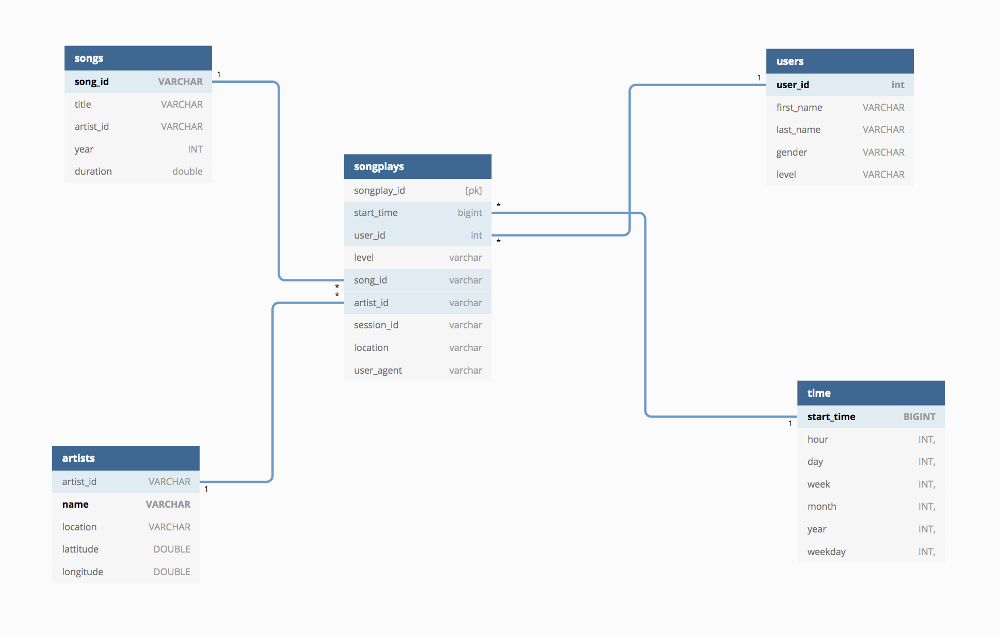
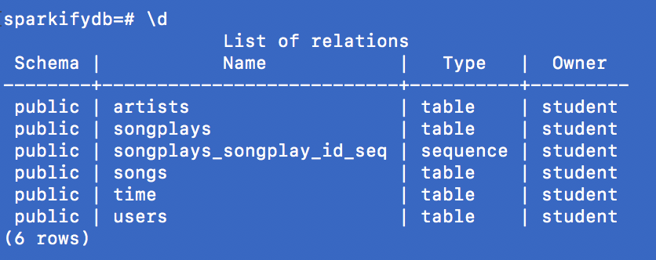

# Data Modeling with Postgres for music play data

## Purpose of project
A startup called Sparkify wants to analyze the data they've been collecting on songs and user activity on their new music streaming app. The analytics team is particularly interested in understanding what songs users are listening to. This project is to to create a Postgres database with tables designed to optimize queries on song play analysis for Sparkify.

## DB Schema



## ELT Pipeline

- Create DB sparkifydb, drop tables if exists, then create with desired schema.
- Load songs data to pop up artists and songs table.
- Load logs data to pop up songplays, time and users table. Songplays table is depended on artists and songs tables.

## DBs

 

## How to run the project

Create DB and Tables: 

```
python3 create_tables.py
```

Load Tables: 

```
python3 etl.py
```

## Check DB loads manually

Connect to sparkifydb:

```
psql sparkifydb
```

List the table you want to check:

```
SELECT count(*) from users;
```
